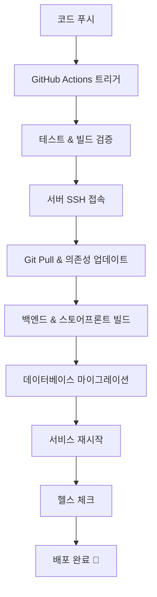

# 🌸 KBeauty.Market CI/CD 설정 가이드

## ✅ **CI/CD 자동 배포 시스템 완료!**

🎉 **KBeauty.Market의 GitHub Actions 자동 배포 시스템이 성공적으로 구축 완료되었습니다!**

### 🚀 현재 운영 상태
- ✅ **GitHub Actions 워크플로우**: 활성화됨
- ✅ **SSH 키 기반 자동 배포**: 설정 완료
- ✅ **GitHub Secrets (DEPLOY_SSH_KEY)**: 구성 완료
- ✅ **자동 배포 스크립트**: 운영 중
- ✅ **헬스체크 시스템**: 정상 작동
- ✅ **서비스 URL**: https://kbeauty.market 운영 중

### 📅 배포 이력
- **2025-07-16**: CI/CD 파이프라인 구축 완료
- **2025-07-16**: GitHub Secrets 설정 완료
- **2025-07-16**: 자동 배포 시스템 활성화

---

## 📋 개요

이 문서는 **KBeauty.Market**의 GitHub Actions를 이용한 자동 배포(CI/CD) 설정 방법과 운영 가이드입니다.

## ✅ 현재 완료된 설정

### 1. ✅ GitHub Repository Secrets 설정 완료

GitHub 저장소의 **Settings** > **Secrets and variables** > **Actions**에 다음 Secret이 설정되어 있습니다:

#### 🔐 `DEPLOY_SSH_KEY` ✅ 완료
- 서버 접속을 위한 SSH 개인키가 설정되어 있습니다
- 자동 배포 시 서버 접속에 사용됩니다

### 2. ✅ SSH 키 생성 및 설정 완료

서버에 SSH 키가 설정되어 배포 준비가 완료되었습니다:

```bash
# 이미 설정 완료된 내용:
# - SSH 키 페어 생성 완료
# - 공개키 authorized_keys 등록 완료  
# - 권한 설정 완료
# - GitHub Secret 등록 완료
```

### 3. ✅ 서버 환경 설정 완료

```bash
# 이미 설정 완료된 내용:
# - 백업 디렉토리 생성 완료
# - 로그 디렉토리 권한 설정 완료
# - 배포 스크립트 설정 완료
```

## 🚀 CI/CD 워크플로우 (운영 중)

### 트리거 조건

1. **Push Event**: `kbeauty/main` 브랜치에 푸시할 때 자동 배포
2. **Pull Request**: PR 생성 시 빌드 테스트 실행
3. **Schedule**: 매일 오전 9시(KST) 자동 업데이트 확인
4. **Manual**: GitHub Actions 페이지에서 수동 실행

### 배포 프로세스



### Job 구성

1. **🧪 Test Job**: PR일 때 빌드 테스트만 실행
2. **🚀 Deploy Job**: `kbeauty/main`에 푸시 시 자동 배포
3. **🏥 Health Check Job**: 배포 후 서비스 상태 확인
4. **📅 Scheduled Update Job**: 정기적으로 업데이트 확인

## 🛠️ 수동 배포 방법

### 1. GitHub Actions 수동 실행

1. GitHub 저장소로 이동
2. **Actions** 탭 클릭
3. **🌸 Deploy KBeauty.Market** 워크플로우 선택
4. **Run workflow** 버튼 클릭
5. Environment 선택 후 실행

### 2. 서버에서 직접 배포

```bash
# 서버에 SSH 접속
ssh barahime@49.247.9.193

# 프로젝트 디렉토리로 이동
cd /home/barahime/github/medusa

# 배포 스크립트 실행
./scripts/deploy.sh production
```

## 📊 모니터링 및 로그

### 배포 로그 확인

```bash
# 최신 배포 로그 확인
ls -la .logs/deploy-*.log | tail -1 | xargs cat

# 실시간 로그 확인
tail -f .logs/deploy-$(date +%Y%m%d)*.log
```

### 서비스 상태 확인

```bash
# 서비스 상태 확인
./scripts/kbeauty-manager.sh status

# 헬스 체크
curl -k https://kbeauty.market
curl -k https://api.kbeauty.market
curl https://db.kbeauty.market
```

## 🔄 업데이트 플로우

### 일반적인 개발 플로우

1. **Feature 브랜치에서 개발**
   ```bash
   git checkout -b feature/new-feature
   # 개발 작업...
   git commit -m "feat: 새로운 기능 추가"
   git push origin feature/new-feature
   ```

2. **Pull Request 생성**
   - GitHub에서 `feature/new-feature` → `kbeauty/main` PR 생성
   - 자동으로 빌드 테스트 실행

3. **PR 승인 및 병합**
   - 코드 리뷰 후 `kbeauty/main`으로 병합
   - 자동으로 프로덕션 배포 실행

4. **배포 완료**
   - https://kbeauty.market에서 변경사항 확인

### 핫픽스 플로우

긴급 수정이 필요한 경우:

```bash
# 핫픽스 브랜치 생성
git checkout kbeauty/main
git pull origin kbeauty/main
git checkout -b hotfix/urgent-fix

# 수정 작업
git commit -m "hotfix: 긴급 버그 수정"
git push origin hotfix/urgent-fix

# 직접 kbeauty/main에 병합
git checkout kbeauty/main
git merge hotfix/urgent-fix
git push origin kbeauty/main
# 자동 배포 실행됨
```

## 🚨 트러블슈팅

### 배포 실패 시

1. **GitHub Actions 로그 확인**
   - Actions 탭에서 실패한 워크플로우 클릭
   - 에러 로그 확인

2. **서버 로그 확인**
   ```bash
   # 서비스 로그 확인
   tail -f .logs/backend.log
   tail -f .logs/storefront.log
   
   # 시스템 로그 확인
   sudo journalctl -u nginx -f
   ```

3. **수동 복구**
   ```bash
   # 이전 백업으로 복구
   ls /home/barahime/backups/
   
   # 서비스 강제 재시작
   ./scripts/kbeauty-manager.sh restart all
   ```

### 일반적인 문제들

| 문제 | 원인 | 해결방법 |
|------|------|----------|
| SSH 연결 실패 | SSH 키 설정 문제 | `DEPLOY_SSH_KEY` Secret 재설정 |
| 빌드 실패 | 의존성 문제 | `yarn install` 재실행 |
| 서비스 시작 실패 | 포트 충돌 | `netstat -tlnp` 확인 후 프로세스 종료 |
| HTTPS 접속 실패 | Nginx/SSL 문제 | `sudo nginx -t && sudo systemctl reload nginx` |

## 📞 지원

문제가 발생하면:

1. **GitHub Issues** 등록
2. **배포 로그** 첨부
3. **에러 메시지** 상세 기록

---

## 🎯 다음 단계

- [ ] 스테이징 환경 구축
- [ ] 데이터베이스 백업 자동화
- [ ] Slack/Discord 알림 연동
- [ ] 성능 모니터링 도구 추가
- [ ] 블루-그린 배포 구현

**🌸 KBeauty.Market - 한국 화장품을 세계로! 🌍** 