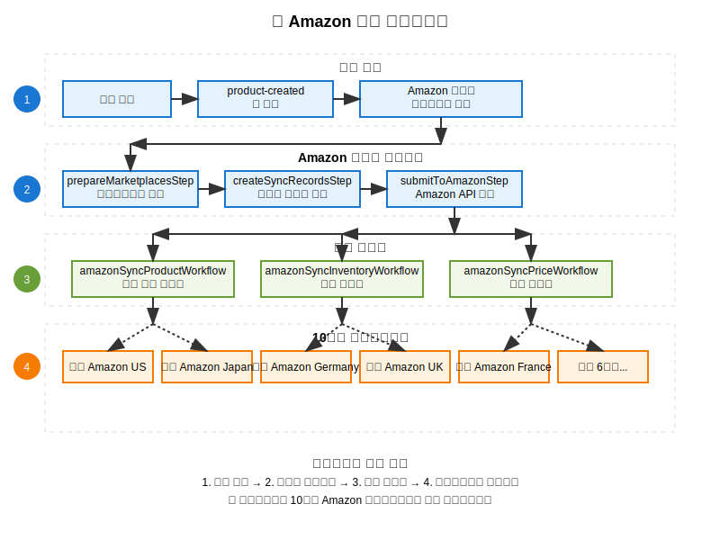
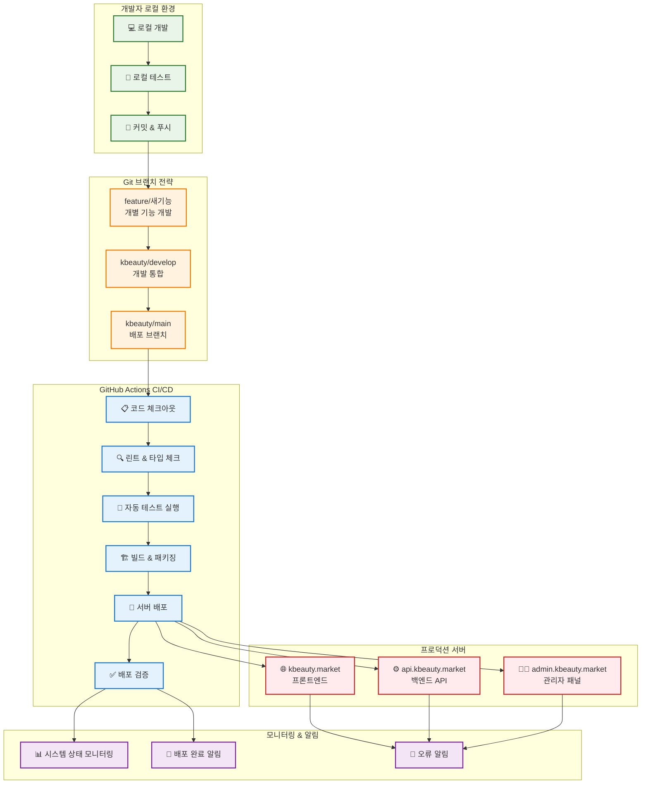

# 🌸 kbeauty.market - 한국 화장품 글로벌 마켓플레이스

kbeauty.market은 Medusa.js v2를 기반으로 한국 화장품을 세계 각국의 아마존을 통해 판매자와 소비자를 연결하는 플랫폼입니다.

## 🚀 빠른 시작

### 1. 포크 및 클론
```bash
# 1. GitHub에서 ComBba/medusa를 본인 계정으로 포크
# 2. 포크된 저장소를 클론
git clone https://github.com/YOUR_USERNAME/medusa.git
cd medusa

# 3. 원본 저장소를 upstream으로 추가
git remote add upstream https://github.com/ComBba/medusa.git

# 4. kbeauty 브랜치로 체크아웃
git checkout kbeauty/main
```

### 2. 환경 설정
```bash
# 환경 변수 설정
cp kbeauty.env.example .env
# .env 파일을 수정하여 필요한 설정 변경

# 의존성 설치
yarn install

# Docker 서비스 시작 (데이터베이스, 레디스 등)
yarn kbeauty:docker:up
```

### 3. 개발 환경 설정
```bash
# 빠른 시작 스크립트 실행 (권장)
./scripts/quick-start.sh

# 또는 수동 설정
./scripts/setup-nginx.sh    # Nginx 설정 (포트 포워딩)
./scripts/setup-hosts.sh    # Hosts 파일 설정 (도메인 매핑)

# 데이터베이스 마이그레이션 및 시드
./scripts/kbeauty-db.sh migrate
./scripts/kbeauty-db.sh seed
./scripts/kbeauty-db.sh create-admin
```

### 4. 개발 서버 실행
```bash
# 전체 개발 환경 실행 (권장)
./scripts/kbeauty-manager.sh start-all

# 또는 개별 실행
yarn kbeauty:backend        # 백엔드 서버 (포트 10000)
yarn kbeauty:storefront     # 스토어프론트 (포트 10004)
yarn kbeauty:admin          # 관리자 패널 (Medusa v2에 내장)
```

## 🌐 서비스 URL

### 개발 환경
- **메인 스토어**: http://localhost:10004 (kbeauty-app-storefront)
- **API 서버**: http://localhost:10000 (kbeauty-app)
- **관리자 패널**: http://localhost:10000/app (Medusa v2 내장)
- **데이터베이스 관리**: http://localhost:10008 (Adminer)
- **파일 저장소**: http://localhost:10009 (MinIO)

### 프로덕션 환경
- **메인 스토어**: https://kbeauty.market
- **API 서버**: https://api.kbeauty.market
- **관리자 패널**: https://admin.kbeauty.market (자동으로 /app 경로로 리다이렉트)
- **데이터베이스 관리**: http://db.kbeauty.market
- **파일 저장소**: http://storage.kbeauty.market

### 포트 정보
- **kbeauty-app**: 10000 (Medusa v2 백엔드 + 관리자)
- **kbeauty-app-storefront**: 10004 (Next.js 스토어프론트)
- **PostgreSQL**: 10002
- **Redis**: 10003
- **Adminer**: 10008
- **MinIO API**: 10009
- **MinIO Console**: 10010

## 🏗️ 프로젝트 구조 및 아키텍처

### 📂 폴더별 역할 및 용도

#### 🌐 **Root (/)** - **Medusa 코어 개발 및 통합 관리**
```
📦 Medusa 코어 코드베이스 + kbeauty.market 통합 환경
├── 🔧 packages/          # Medusa.js 프레임워크 코어 코드
├── 🌸 src/kbeauty/       # K-뷰티 전용 설정
├── 🚀 scripts/           # 통합 관리 스크립트
├── 🐳 docker-compose.yml # 전체 서비스 오케스트레이션
└── 📋 package.json       # 모노레포 관리
```

**주요 역할:**
- **Medusa.js 코어 개발**: 프레임워크 자체를 개발/수정
- **통합 환경 관리**: Docker, Nginx, DB 등 인프라 설정
- **원클릭 개발환경**: `quick-start.sh`로 전체 환경 구축
- **K-뷰티 설정**: 국가별 마켓플레이스, 브랜드 설정 (src/kbeauty/config/)

---

#### 🔧 **kbeauty-app/** - **Medusa 백엔드 API 서버**
```
📦 Medusa 백엔드 애플리케이션
├── 🛠️ src/modules/       # 커스텀 모듈 (Amazon 통합 등)
├── 🔄 src/workflows/     # 비즈니스 워크플로우 (Amazon 동기화)
├── 🌐 src/api/           # REST API 라우트
├── 👨‍💼 src/admin/        # 관리자 패널 커스터마이징
├── 🔗 src/subscribers/   # 이벤트 구독자
└── ⚙️ medusa-config.ts  # Medusa 설정
```

**주요 기능:**
- **🛒 E-commerce API**: 상품, 주문, 결제, 배송 관리
- **🌍 Amazon 통합**: 10개국 마켓플레이스 동기화
- **📦 재고 관리**: 실시간 재고 추적 및 업데이트  
- **💳 결제 처리**: Stripe 등 결제 게이트웨이 연동
- **👥 사용자 관리**: 고객 계정, 권한 관리
- **📊 관리자 대시보드**: 백오피스 관리 기능

**포트:** 10000 (API), 10001 (Admin)

---

#### 🎨 **kbeauty-app-storefront/** - **Next.js 고객용 웹사이트**
```
📦 Next.js 15 프론트엔드
├── 🎯 src/app/           # App Router (Next.js 15)
├── 🧩 src/modules/       # 재사용 가능한 컴포넌트
├── 💅 src/styles/        # Tailwind CSS 스타일
├── 📡 src/lib/           # API 클라이언트, 유틸리티
└── 🌐 src/types/         # TypeScript 타입 정의
```

**주요 기능:**
- **🛍️ 쇼핑몰**: 상품 브라우징, 검색, 필터링
- **🛒 장바구니**: 실시간 장바구니 관리
- **💳 결제**: Stripe 통합 결제 시스템
- **👤 계정**: 회원가입, 로그인, 주문 이력
- **📱 반응형**: 모바일/데스크톱 최적화
- **⚡ 성능**: Next.js 15 Server Components, Streaming

**포트:** 10004

### 🔗 시스템 아키텍처 및 상호작용

#### 📊 **상세 시스템 구조도**

<div align="center">



</div>

#### 🔄 **데이터 흐름 및 통신 방식**

| 연결 | 프로토콜/방식 | 설명 |
|------|---------------|------|
| **고객 ↔ Storefront** | HTTPS/HTTP | 웹 브라우저를 통한 사용자 인터페이스 |
| **Storefront ↔ Backend** | REST API, GraphQL | JSON 기반 API 통신 |
| **관리자 ↔ Backend** | HTTPS + JWT | 관리자 패널 접근 및 인증 |
| **Backend ↔ PostgreSQL** | TCP/SQL | 주요 데이터 저장 및 조회 |
| **Backend ↔ Redis** | TCP/Redis Protocol | 캐시 및 세션 관리 |
| **Backend ↔ MinIO** | S3 Compatible API | 파일 업로드/다운로드 |
| **Backend ↔ Amazon APIs** | HTTPS/REST | SP-API를 통한 마켓플레이스 연동 |

#### 🌍 **Amazon 통합 워크플로우**

<div align="center">



</div>

**🔄 워크플로우 실행 순서:**
1. **상품 등록** → Medusa 관리자 패널에서 새 상품 생성
2. **자동 훅 실행** → `product-created.ts` 훅이 자동으로 Amazon 동기화 시작
3. **마켓플레이스 검증** → 활성화된 마켓플레이스 확인 및 필터링
4. **동기화 레코드 생성** → 각 마켓플레이스별 동기화 상태 추적 레코드 생성
5. **병렬 동기화** → 상품정보/재고/가격을 각 마켓플레이스에 동시 업데이트
6. **결과 수집** → 성공/실패 상태를 로그에 기록하고 관리자에게 알림

### 🎯 개발 워크플로우

#### **팀 역할 분리**
- **백엔드 개발자** → `kbeauty-app/` 작업
- **프론트엔드 개발자** → `kbeauty-app-storefront/` 작업  
- **DevOps/인프라** → `Root/` 환경 관리

#### **독립적 개발**
```bash
# 백엔드만 개발
cd kbeauty-app && npm run dev

# 프론트엔드만 개발  
cd kbeauty-app-storefront && npm run dev

# 전체 환경 (Root에서)
./scripts/quick-start.sh
```

#### 🚀 **CI/CD 파이프라인 및 Git 워크플로우**



**🔄 배포 프로세스:**
1. **로컬 개발** → `feature/` 브랜치에서 개발 진행
2. **Pull Request** → `kbeauty/develop`으로 PR 생성 및 코드 리뷰
3. **통합 테스트** → `develop` 브랜치에서 통합 테스트 실행
4. **배포 준비** → `kbeauty/main` 브랜치로 병합
5. **자동 배포** → GitHub Actions가 자동으로 배포 파이프라인 실행
6. **배포 완료** → 프로덕션 서버 업데이트 및 알림

### 📁 상세 디렉토리 구조

```
.
├── kbeauty-app/              # 🔧 Medusa v2 백엔드 애플리케이션
│   ├── src/
│   │   ├── api/              # REST API 라우트
│   │   ├── workflows/        # 비즈니스 로직 워크플로우 (Amazon 동기화)
│   │   ├── modules/          # 커스텀 모듈 (Amazon 통합 모듈)
│   │   ├── subscribers/      # 이벤트 구독자
│   │   ├── admin/            # 관리자 패널 커스터마이징
│   │   └── scripts/          # 데이터베이스 시드 스크립트
│   ├── medusa-config.ts      # Medusa 설정
│   └── package.json
│
├── kbeauty-app-storefront/   # 🎨 Next.js 스토어프론트 애플리케이션
│   ├── src/
│   │   ├── app/              # Next.js 15+ App Router
│   │   ├── modules/          # 재사용 가능한 React 컴포넌트
│   │   ├── lib/              # API 클라이언트, 유틸리티 및 설정
│   │   ├── styles/           # Tailwind CSS 스타일 파일
│   │   └── types/            # TypeScript 타입 정의
│   ├── public/               # 정적 파일
│   ├── next.config.js        # Next.js 설정 (빌드 시간 시스템 정보 포함)
│   └── package.json
│
├── src/kbeauty/              # 🌸 K-뷰티 전용 설정
│   └── config/
│       └── countries.js      # 국가별 마켓플레이스 및 브랜드 설정
│
├── scripts/                  # 🚀 개발 및 배포 스크립트
│   ├── kbeauty-manager.sh    # 메인 관리 스크립트 (CI/CD 포함)
│   ├── kbeauty-db.sh         # 데이터베이스 관리 스크립트
│   ├── kbeauty-aliases.sh    # 개발 도구 별칭
│   ├── quick-start.sh        # 빠른 시작 스크립트
│   ├── setup-nginx.sh        # Nginx 설정 스크립트
│   ├── setup-hosts.sh        # Hosts 파일 설정 스크립트
│   └── deploy.sh             # 배포 스크립트
│
├── .github/
│   └── workflows/
│       └── deploy-kbeauty.yml # GitHub Actions 자동 배포 워크플로우
│
├── packages/                 # 🔧 Medusa.js 프레임워크 코어 코드
│   ├── medusa/               # 코어 Medusa 패키지
│   ├── framework/            # Medusa 프레임워크
│   └── ...                   # 기타 코어 패키지들
│
├── docker-compose.yml        # 🐳 Docker 서비스 정의
├── nginx/                    # 🌐 Nginx 설정 파일
├── kbeauty.env.example       # 🔑 환경 변수 템플릿
├── medusa-config.js          # 🏗️ 루트 Medusa 설정 (레거시)
└── README.kbeauty.md         # 📖 이 파일
```

### 💡 핵심 정리

| 폴더 | 용도 | 기술스택 | 개발자 | 포트 |
|------|------|----------|--------|------|
| **Root** | 🔧 **통합 환경 + Medusa 코어** | Docker, Scripts, Medusa Core | DevOps | - |
| **kbeauty-app** | 🛒 **E-commerce API + Amazon 통합** | Medusa.js, TypeScript, PostgreSQL | Backend | 10000 |
| **kbeauty-app-storefront** | 🎨 **고객용 쇼핑몰** | Next.js 15, React, Tailwind | Frontend | 10004 |

이 구조를 통해 **각 팀이 독립적으로 개발**하면서도 **통합된 K-뷰티 마켓플레이스**를 구축할 수 있습니다! 🌟

## 🛠️ 개발 가이드

### 주요 명령어

#### 🚀 빠른 시작
```bash
# 전체 개발 환경 빠른 시작
./scripts/quick-start.sh

# 메인 관리 스크립트 사용 (추천)
./scripts/kbeauty-manager.sh [command]

# 서비스 관리
./scripts/kbeauty-manager.sh start-all      # 모든 서비스 시작
./scripts/kbeauty-manager.sh stop-all       # 모든 서비스 중지
./scripts/kbeauty-manager.sh restart-all    # 모든 서비스 재시작
./scripts/kbeauty-manager.sh status         # 서비스 상태 확인
```

#### 🛠️ 개별 서비스 관리
```bash
# 백엔드 서비스
./scripts/kbeauty-manager.sh start-backend  # kbeauty-app 시작
./scripts/kbeauty-manager.sh stop-backend   # kbeauty-app 중지

# 프론트엔드 서비스  
./scripts/kbeauty-manager.sh start-frontend # kbeauty-app-storefront 시작
./scripts/kbeauty-manager.sh stop-frontend  # kbeauty-app-storefront 중지

# Docker 서비스
./scripts/kbeauty-manager.sh start-docker   # PostgreSQL, Redis, MinIO 등 시작
./scripts/kbeauty-manager.sh stop-docker    # Docker 서비스 중지
```

#### 🗄️ 데이터베이스 관리
```bash
# 데이터베이스 관리 스크립트
./scripts/kbeauty-db.sh [command]

# 자주 사용하는 명령어
./scripts/kbeauty-db.sh migrate         # 마이그레이션 실행
./scripts/kbeauty-db.sh seed             # 시드 데이터 삽입
./scripts/kbeauty-db.sh create-admin     # 관리자 계정 생성
./scripts/kbeauty-db.sh backup           # 데이터베이스 백업
./scripts/kbeauty-db.sh connect          # 데이터베이스 연결
```

#### 🚀 CI/CD 관리
```bash
# CI/CD 시스템 관리
./scripts/kbeauty-manager.sh cicd          # CI/CD 상태 확인
./scripts/kbeauty-manager.sh deploy        # 수동 배포 실행
./scripts/kbeauty-manager.sh deploy-logs   # 배포 로그 확인
./scripts/kbeauty-manager.sh git-status    # Git 상태 확인
```

#### 🔧 개발 도구 별칭
```bash
# 별칭 로드 (터미널에서 한 번만 실행)
source scripts/kbeauty-aliases.sh

# 사용 가능한 별칭들
kstart-all      # 모든 서비스 시작
kstop-all       # 모든 서비스 중지  
kstatus         # 상태 확인
kdev            # 개발 환경 빠른 시작
khelp           # 도움말 확인
```

### 백엔드 개발 (kbeauty-app)
- **기반**: Medusa.js v2.8.7
- **포트**: 10000
- **설정**: `kbeauty-app/medusa-config.ts`
- **API 문서**: http://localhost:10000/docs
- **관리자 패널**: http://localhost:10000/app
- **프로덕션 관리자**: https://admin.kbeauty.market

### 프론트엔드 개발 (kbeauty-app-storefront)
- **기반**: Next.js 14 + App Router
- **포트**: 10004
- **설정**: `kbeauty-app-storefront/next.config.js`
- **스타일링**: Tailwind CSS + @medusajs/ui
- **상태 관리**: Zustand

## 🌟 구현 완료된 기능

### ✅ 시스템 정보 표시
- **Footer 시스템 정보**: 커밋 해시, 브랜치, 배포 시간 (KST)
- **Hero 섹션 배지**: 현재 버전 정보 표시
- **시스템 정보 팝업**: 상세한 시스템 정보 (⚙️ 버튼)
- **GitHub 링크**: 커밋 및 브랜치로 직접 이동 가능

### ✅ CI/CD 자동 배포 시스템
- **GitHub Actions**: kbeauty/main 브랜치 푸시 시 자동 배포
- **SSH 배포**: 포트 17141을 통한 안전한 SSH 연결
- **워크플로우 최적화**: 불필요한 원본 Medusa 워크플로우 제거
- **배포 상태 모니터링**: 배포 로그 및 상태 확인 가능

### ✅ 개발 환경 도구
- **관리 스크립트**: 통합된 서비스 관리
- **데이터베이스 도구**: 백업, 복원, 마이그레이션 자동화
- **개발 별칭**: 빠른 명령어 접근
- **빠른 시작**: 원클릭 개발 환경 설정

### ✅ 인프라 설정
- **Docker 컨테이너**: PostgreSQL, Redis, MinIO, Adminer
- **포트 관리**: 충돌 없는 포트 배정
- **환경 변수**: 개발/프로덕션 환경 분리
- **Nginx 프록시**: 도메인 기반 라우팅 (선택사항)

## 🐳 Docker 서비스

### 서비스 관리
```bash
# 모든 서비스 시작
./scripts/kbeauty-manager.sh start-docker

# 모든 서비스 중지
./scripts/kbeauty-manager.sh stop-docker

# 로그 확인
docker-compose logs -f [service_name]

# 특정 서비스만 실행
docker-compose up -d postgres redis
```

### 포함된 서비스
- **PostgreSQL**: 메인 데이터베이스 (포트 10002)
- **Redis**: 캐시 및 세션 스토어 (포트 10003)
- **Adminer**: 데이터베이스 관리 도구 (포트 10008)
- **MinIO**: S3 호환 파일 저장소 (API: 10009, Console: 10010)

## 🌟 kbeauty.market 특화 기능

### 계획된 기능
1. **다국가 아마존 연동**: 미국, 일본, 독일, 영국 등 아마존 마켓플레이스 연동
2. **한국 화장품 카테고리**: K-뷰티 특화 상품 분류 및 필터링
3. **다국어 지원**: 한국어, 영어, 일본어, 중국어 등 다국어 인터페이스
4. **환율 연동**: 실시간 환율 정보 제공 및 가격 변환
5. **배송 추적**: 국제 배송 추적 시스템 및 알림
6. **리뷰 시스템**: 다국가 리뷰 통합 관리 및 번역

### 개발 우선순위
1. ✅ 기본 e-commerce 기능 구현 (Medusa v2 기반)
2. ✅ CI/CD 자동 배포 시스템 구축
3. ✅ 시스템 정보 및 모니터링 기능
4. 🔄 아마존 API 연동 모듈 개발 (진행 중)
5. 📋 다국어 지원 시스템 구축
6. 📋 결제 시스템 연동 (Stripe, PayPal 등)
7. 📋 배송 및 물류 관리 시스템

### 협업 가이드
1. **브랜치 전략**: `kbeauty/main` > `kbeauty/develop` > `kbeauty/feature/기능명`
2. **코드 스타일**: ESLint + Prettier 설정 준수
3. **커밋 메시지**: 한국어 또는 영어 일관성 유지
4. **PR 리뷰**: 모든 변경사항은 코드 리뷰 후 병합
5. **자동 배포**: kbeauty/main 브랜치 푸시 시 자동 배포

## 🔧 관리자 패널 접속 방법

### 개발 환경
```bash
# 로컬 접속 (권장)
http://localhost:10000/app

# 도메인 접속 (nginx 프록시 사용시)
http://admin.kbeauty.market/app
```

### 프로덕션 환경
```bash
# HTTPS 접속 (SSL 인증서 설정 필요)
https://admin.kbeauty.market/app
```

### 기본 관리자 계정
- **이메일**: admin@medusa-test.com
- **비밀번호**: supersecret

### 새 관리자 계정 생성
```bash
./scripts/kbeauty-db.sh create-admin
```

## 📞 지원

문제가 발생하거나 질문이 있으시면:
1. GitHub Issues에 문제 등록: https://github.com/ComBba/medusa/issues
2. 개발팀에 직접 연락
3. Medusa.js v2 공식 문서 참조: https://v2-docs.medusajs.com

### 일반적인 문제 해결

**Q: https://admin.kbeauty.market에 접속이 안 됩니다**
A: 다음을 확인하세요:
1. 백엔드 서버 실행 상태: `./scripts/kbeauty-manager.sh status`
2. nginx 서비스 상태: `sudo systemctl status nginx`
3. SSL 인증서 설정 (프로덕션 환경)
4. 로컬에서 먼저 테스트: `http://localhost:10000/app`

**Q: 403 Forbidden 오류가 발생합니다**
A: 브라우저에서 직접 접속을 시도하세요. curl 테스트에서는 세션/쿠키 처리가 제한적일 수 있습니다.

## 📄 라이선스

이 프로젝트는 MIT 라이선스 하에 배포됩니다.

---

## 🚀 CI/CD 자동 배포 시스템 설정 완료!

✅ **GitHub Actions 워크플로우 설정 완료**  
✅ **SSH 키 배포 스크립트 설정 완료** (포트 17141)  
✅ **GitHub Secrets (DEPLOY_SSH_KEY) 설정 완료**  
✅ **불필요한 워크플로우 파일 정리 완료** (18개 파일 삭제)  
✅ **자동 배포 시스템 활성화됨!**

kbeauty/main 브랜치에 push하면 자동으로 서버에 배포됩니다! 🎉  
서비스 URL: https://kbeauty.market

### 최신 업데이트 (2025.07.16)
- ✅ 시스템 정보 표시 기능 구현 (커밋 정보, GitHub 링크, KST 시간)
- ✅ GitHub Actions 워크플로우 최적화 (kbeauty 전용)
- ✅ SSH 연결 포트 17141 설정 및 배포 안정화
- ✅ 프로젝트 구조 정리 및 문서화 완료

### 최신 업데이트 (2025.07.17)
- ✅ **관리자 패널 nginx 프록시 문제 해결**: IPv4/IPv6 연결 문제 및 포트 설정 수정
- ✅ **CORS 설정 개선**: admin.kbeauty.market 도메인 추가
- ✅ **백엔드 서버 설정 최적화**: HOST=0.0.0.0 설정으로 모든 인터페이스에서 접근 가능
- 🔧 **SSL 인증서 설정 필요**: 프로덕션 환경에서 올바른 SSL 인증서 구성 권장
